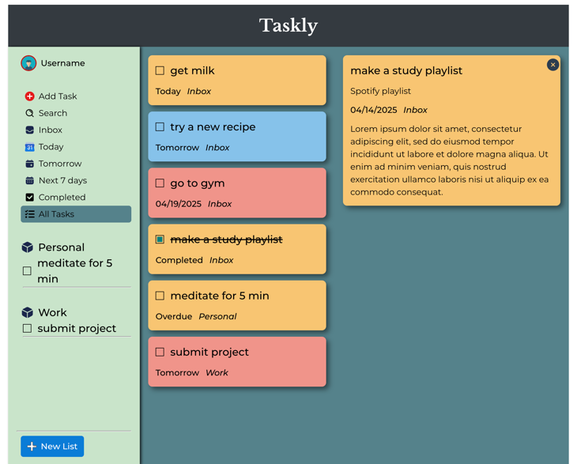

# The Odin Project - To Do List solution

This is a solution for the [Todo List project on The Odin Project](https://www.theodinproject.com/lessons/node-path-javascript-todo-list)

## Table of contents

- [The Odin Project - To Do List solution](#the-odin-project---to-do-list-solution)
  - [Table of contents](#table-of-contents)
  - [Overview](#overview)
    - [Key Features](#key-features)
    - [Screenshots](#screenshots)
    - [Links](#links)
  - [Acknowledgments](#acknowledgments)
    - [Icons](#icons)

## Overview

This Todo List project is a simple productivity application that helps users manage tasks efficiently. The core functionality allows users to add, remove, and mark tasks as completed. Buttons in the sidebar help users navigate to different sections of the app. Edit, Delete and Details buttons can be seen when hovered over a task to perform the respective actions. Use 'New List' button to create a new list/project. Search feature is limited to case insensitive title search only.

### Key Features

- **Add Task:** Users can easily add new tasks with titles and deadlines and optional description and notes
- **View Tasks:** All tasks are displayed in a list with options to filter by status and date (e.g., completed, incomplete, today, tomorrow etc.) 
- **Edit Task:** Users can edit task details, such as title, description, notes, and deadline
- **Delete Task:** Users can delete tasks they no longer need
- **Mark Task as Completed:** Users can mark tasks as completed to indicate that they have been completed

### Screenshots

### Links

- Solution URL: [https://github.com/py-code314/to-do-list](https://github.com/py-code314/to-do-list)
- Live Site URL: [ https://py-code314.github.io/to-do-list/]( https://py-code314.github.io/to-do-list/)

## Acknowledgments

### Icons
1. All icons are from [SVG Repo](https://www.svgrepo.com/) website.

